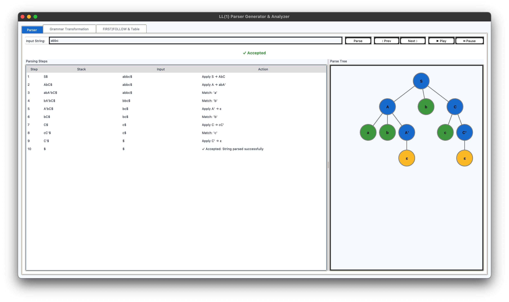

# LL(1) Predictive Parser Desktop Application

A modular, professional desktop application for interactive LL(1) predictive parsing, grammar analysis, and visualization, built with Python and Tkinter.

---

## Features

- **LL(1) Predictive Parsing**: Step-by-step, non-recursive parsing for user-input strings.
- **Grammar Analysis Pipeline**:
  - Custom grammar simplification
  - Automatic elimination of left recursion
  - Left factoring for LL(1) compliance
  - FIRST and FOLLOW set computation
  - Predictive parsing table construction
- **Interactive GUI**:
  - Modern, themed Tkinter interface
  - Tabs for parsing, grammar transformation, and table/sets
  - Input string parsing with animated step navigation (play, pause, next, prev)
  - Real-time parse tree visualization (zoom, pan)
  - Display of parsing steps, grammar transformations, FIRST/FOLLOW sets, and parsing table
- **Modular Codebase**: Clean separation of grammar logic, parsing, and UI for easy extension and maintenance.

---

## Screenshots

### Parse Tree Visualization


### FIRST/FOLLOW Sets and Table


---

## Folder Structure

```
compiler/
├── grammar/
│   ├── analyzer.py
│   ├── first_follow_calculator.py
│   ├── left_factoring.py
│   ├── left_recursion_eliminator.py
│   ├── parsing_table_builder.py
│   ├── simplifier.py
│   └── __init__.py
├── syntax_parser/
│   ├── predictive_parser.py
│   ├── tree.py
│   └── __init__.py
├── ui/
│   ├── app.py
│   ├── tree_canvas.py
│   └── __init__.py
├── main.py
├── parsetree.png
├── firstfollow.png
└── README.md
```

---

## How to Run

1. **Requirements**: Python 3.x (Tkinter is included by default on most systems).
2. **Run the Application**:
   ```sh
   python main.py
   ```
   The GUI will launch for interactive use.

---

## Module Overview

### Grammar Analysis (`grammar/`)
- **analyzer.py**: Orchestrates the full grammar transformation and analysis pipeline.
- **simplifier.py**: Custom grammar simplification logic.
- **left_recursion_eliminator.py**: Removes direct and indirect left recursion.
- **left_factoring.py**: Applies left factoring to enable LL(1) parsing.
- **first_follow_calculator.py**: Computes FIRST and FOLLOW sets for all non-terminals.
- **parsing_table_builder.py**: Constructs the LL(1) predictive parsing table.

### Syntax Parser (`syntax_parser/`)
- **predictive_parser.py**: Implements the LL(1) predictive parser, including step-by-step parsing and parse tree construction.
- **tree.py**: Defines the `TreeNode` class for parse tree representation.

### User Interface (`ui/`)
- **app.py**: Main Tkinter application, manages tabs, input, and all UI logic.
- **tree_canvas.py**: Custom canvas widget for interactive parse tree visualization.

### Entry Point
- **main.py**: Launches the grammar analysis, parser, and GUI.

---

## Usage

- **Input a string** in the Parser tab and click "Parse" to see step-by-step parsing and tree construction.
- **Navigate steps** using Next, Prev, Play, and Pause controls.
- **View grammar transformations** and the final LL(1) grammar in the Grammar Transformation tab.
- **Inspect FIRST/FOLLOW sets and the parsing table** in the Table tab.
- **Interact with the parse tree**: zoom and pan for detailed inspection.

---

## Extending the Project

- Add or modify grammar rules in `main.py` or extend the grammar modules for new features.
- UI and parser logic are decoupled for easy adaptation to new grammars or parsing strategies.

---

## License

MIT # LL1-Predictive-Parser-Python-Tkinter
